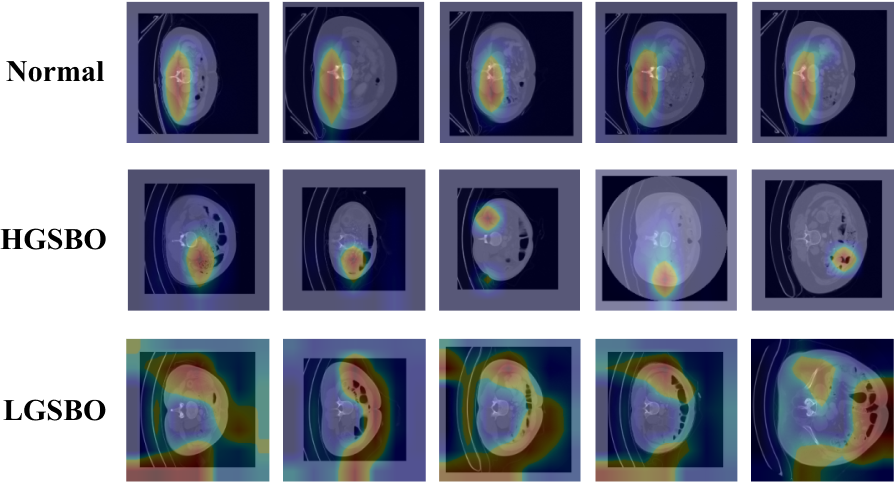

# Deep learning using computed tomography to identify high-risk patients for acute small bowel obstruction: development and validation of a prediction model

PyTorch implementation and pretrained models for DBA+DRP. For details, see the paper: [Deep learning using computed tomography to identify high-risk patients for acute small bowel obstruction: development and validation of a prediction model](TBD)

## Pre-trained models

You can downlaod weights of the backbones used in our experiments. Detailed arguments and learning/assessment methods can be found in the [configs folder](./configs). The path of weights is in the top-level of the project folder(`./intestinal_obstruction/weights`).

<table style="margin:auto;text-align:center">
    <tr>
        <td>Backbone</td>
        <td>Methods</td>
        <td>Accuracy(%)</td>
        <td>AUROC</td>
        <td>Download</td>
    </tr>
    <tr>
        <td rowspan='2'> ResNet </td>
        <td>Naive</td>
        <td>66.15</td>
        <td>0.848 + 0.05</td>
        <td><a href='https://ajouackr-my.sharepoint.com/:u:/g/personal/mangusn1_ajou_ac_kr/EbQ22Q7NQT1FnaQX6xRI0bABuOB0Y9AoW5wW7niLlcM29g?e=DlIcEj'>Link</a></td>
    </tr>
    <tr>
        <td>DBA+DRP</td>
        <td>70.26</td>
        <td>0.876 + 0.02</td>
        <td><a href='https://ajouackr-my.sharepoint.com/:u:/g/personal/mangusn1_ajou_ac_kr/EYh1XbIYYbBBjmS3Lfdn494B_gbpJPQyo4w5djf8LRVHkg?e=r10PUK'>Link</a></td>
    </tr>
    <tr>
        <td rowspan='2'> ResNext </td>
        <td>Naive</td>
        <td>68.46</td>
        <td>0.874 + 0.02</td>
        <td><a href='https://ajouackr-my.sharepoint.com/:u:/g/personal/mangusn1_ajou_ac_kr/ERKW4EDIRiNLs9plr9ch4eYBWQAoMKwo-RLDzckvrKY3yQ?e=RczK4i'>Link</a></td>
    </tr>
    <tr>
        <td>DBA+DRP</td>
        <td>66.41</td>
        <td>0.883 + 0.01</td>
        <td><a href='https://ajouackr-my.sharepoint.com/:u:/g/personal/mangusn1_ajou_ac_kr/EU7z4aDcl7NDusWolN__l2oBxj68CCZjj-P-fBXrgowWWQ?e=YJWvuE'>Link</a></td>
    </tr>
    <tr>
        <td rowspan='2'> WideResNet </td>
        <td>Naive</td>
        <td>65.13</td>
        <td>0.861 + 0.02</td>
        <td><a href='https://ajouackr-my.sharepoint.com/:u:/g/personal/mangusn1_ajou_ac_kr/EdDiTH1y8xNIlLUtL1h7uMABuoQHmhK8jZM4SwHMzNqiDQ?e=gYFcf0'>Link</a></td>
    </tr>
    <tr>
        <td>DBA+DRP</td>
        <td>72.56</td>
        <td>0.896 + 0.01</td>
        <td><a href='https://ajouackr-my.sharepoint.com/:u:/g/personal/mangusn1_ajou_ac_kr/EbRTVzIyMaxDpdO5U0wB-bsBs3gh_FUBo5abWtSeyKDV0g?e=39KMcb'>Link</a></td>
    </tr>
    <tr>
        <td rowspan='2'> DenseNet </td>
        <td>Naive</td>
        <td>75.12</td>
        <td>0.868 + 0.05</td>
        <td><a href='https://ajouackr-my.sharepoint.com/:u:/g/personal/mangusn1_ajou_ac_kr/ERI-sdq-Ze5JjMo-0SYbLGEBdMbtufwq88Aj-AXGDOAZwQ'>Link</a></td>
    </tr>
    <tr>
        <td>DBA+DRP</td>
        <td>72.68</td>
        <td>0.873 + 0.07</td>
        <td><a href='https://ajouackr-my.sharepoint.com/:u:/g/personal/mangusn1_ajou_ac_kr/Edz2ZUrnqflKuWikqU89E0ABA_a5Ee_e-XZvLayG9CjAlw'>Link</a></td>
    </tr>
    <tr>
        <td rowspan='2'> EfficientNet </td>
        <td>Naive</td>
        <td>71.22</td>
        <td>0.841 + 0.04</td>
        <td><a href='https://ajouackr-my.sharepoint.com/:u:/g/personal/mangusn1_ajou_ac_kr/ERMGEqWzKpdCisrAeWmezdgBLdi533feseX3fE39bS6ASQ'>Link</a></td>
    </tr>
    <tr>
        <td>DBA+DRP</td>
        <td>71.71</td>
        <td>0.868 + 0.03</td>
        <td><a href='https://ajouackr-my.sharepoint.com/:u:/g/personal/mangusn1_ajou_ac_kr/EcjnrRw6tbhOgYgNojisVBIBZZLGSmwBIAfUKKgxov_4-A'>Link</a></td>
    </tr>
    <tr></tr>
</table>

## Training

### Requriements

Please install the requirements including pytorch for stable running. This code has been developed with python3.8 and PyTorch 2.0.1, torch 0.19, and CUDA 11.8.

```bash
pip install -r requirements.txt
```

---

### Single training

Run on general train/valid dataset with single GPU for 100 epochs as following command. You can choose specific backbone and methods using `-` notation(`backbone=resnet` or `backbone=resnet-dbadrp`). For other configs and config structures, please check out the [configs folder](./configs).

```bash
python main.py dataset=asbo gpus=[0] train.epochs=100 backbone=resnet-dbadrp
```

---

### K-Fold training

By default, we train using 5-fold cross validation and evaluated the model with average values. For 5-fold training, all you need to do is change a few commands for the dataset and execute file. 

```bash
python cross_validation_train.py dataset=asbo-k gpus=[0] backbone=resnet-dbadrp
```

---

### Inference

Before checking the model performance, the all weight files should be located in `weights` forder in the foramt ‘model_{n}k_best.pt’(resnet0k_best.pt, resnet1k_best.pt, …., etc.). If weight files are located well, you just run. This will automatically evaluate about all 5 folds.

```bash
python cross_inference.py
```
## Visualization of featuremap

To generate the GradCAM of last layer, please run the following command. However, as with inference, the model must be in the right directory before running the command. You can modify the method, gpus, k, etc.

```
python gradcam.py
```



## Folder structure of dataset

The data has three classes, **`HGSBO`**, **`LGSBO`** and **`NORMAL`**, which are located in the top-level folder. Each folder has folders separated by patient name, and each folder has a `.dcm` file containing CT images. The data splitting according to k-fold is stored in the `splits` folder as a `.json` file, and the corrupted data for the robustness test is organized under the `distort` folder with distory_type, intenstiy, and classes.

```
./data
├── HGSBO
│   └── patient_id
|		└── 0001.dcm
|		└── ...
├── LGSBO
│   └── patient_id
|		└── 0001.dcm
|		└── ...
├── NORMAL
│   └── patient_id
|		└── 0001.dcm
|		└── ...
distort
├── affine # dist_type
│   └── 0 # intensity
│       ├── HGSBO #class
│       ├── LGSBO #class
│       └── NORMAL #class
└── splits
    └── asbo_k_classification.json
```

The `.json` files are constructed by `list` with 5 length, and each item of list is `dict`with keys: train, train_label, valid, valid_label.

## LIcense

This repository is released under the Apache 2.0 license as found in the [LICENSE](./LICENSE) file.

## Citation

If our project is helpful for your research, please consider citation:paperclip: and giving a star:star2: :

***TBD***

